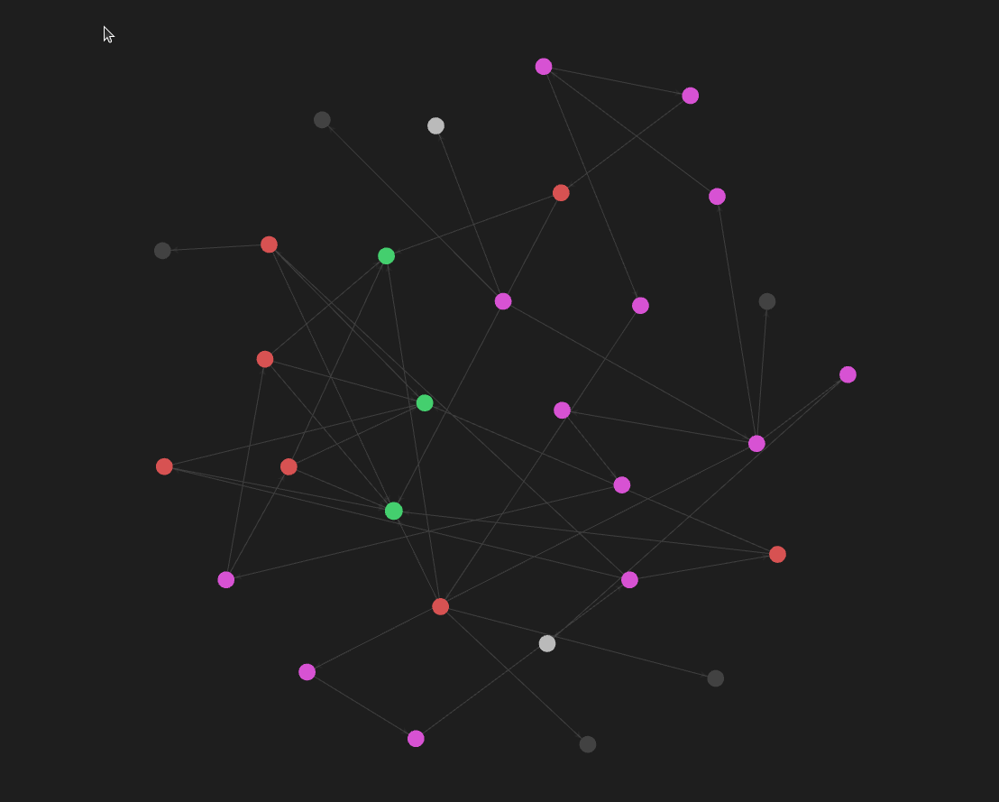

# Livros

* A Arte do desenvolvimento ágil (XP)
* Ciando Microsserviços - Projetando sistemas com componentes menores e mais especializados
* De monitoração à observabilidade
* Engenharia de Confiabildiade do Google - Como o google administra seus sistemas de produção
* Manual de DevOps
* Microsserviços prontos para produção - construindo sistemas padronizados em uma organização de engenharia de software
  

# Mapa

